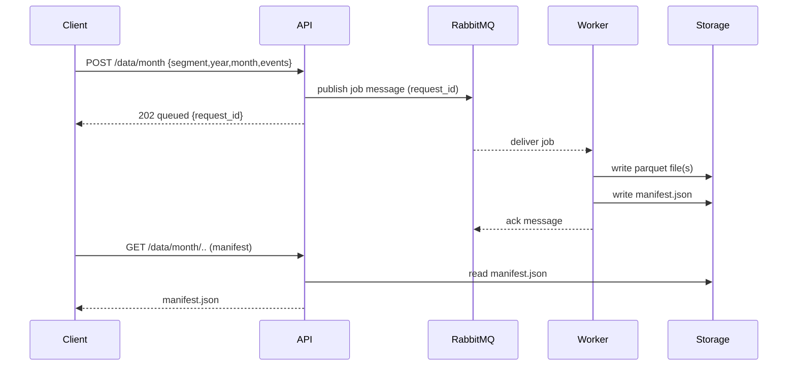

## Alpha Forge — Data Service Low-Level Design (LLD)

Goal
----
This document explains the Data Service architecture, components, and runtime flow in simple terms so both technical and non-technical people can understand how the system works.

High-level summary
-------------------
- The Data Service exposes an HTTP API where clients can ask to create or validate monthly data (parquet files).
- When a client requests a month-to-be-created, the API sends a message to RabbitMQ (a queue/broker).
- A separate Worker process listens to RabbitMQ, picks up jobs, creates the monthly parquet file(s), and writes a small manifest (metadata) describing the files.
- The manifest helps readers (backtest tools, dashboards) to locate and filter monthly data quickly.

Why use a queue (RabbitMQ)?
----------------------------
- Decouples API from heavy work: the API returns quickly after enqueuing the job.
- Worker can process jobs reliably, with retries and durability.
- Multiple workers can run in parallel to scale processing.

Primary components (files and functionality)
--------------------------------------------
- API (FastAPI)
  - File: `apps/data_service/src/api/app.py` — FastAPI app and lifecycle hooks.
  - File: `apps/data_service/src/api/service.py` — HTTP handlers (POST /data/month, GET manifest, GET data, etc.).
  - Purpose: accept client requests, validate inputs, and publish jobs to RabbitMQ.

- RabbitMQ Publisher
  - File: `apps/data_service/src/api/rabbit.py`
  - Purpose: connect to RabbitMQ and publish job messages (JSON) to the queue.

- Worker / Consumer
  - File: `apps/data_service/src/api/worker.py`
  - Purpose: connect to RabbitMQ, consume messages, and execute the job (create parquet + manifest).
  - Runs as a separate process (long-running). It acknowledges messages after successful processing.

- Monthly data writer
  - File: `apps/data_service/src/api/monthly.py`
  - Purpose: low-level helpers to write parquet files, generate manifest.json and validate existing manifests.
  - Implements the core logic: ensure directories, write pyarrow parquet, compute min/max timestamps, and build manifest metadata.

- ClickHouse client and logging
  - File: `apps/data_service/src/clients/clickhouse_client.py` — optional integration for upstream read/write.
  - File: `apps/data_service/src/config/logger.py` — centralized logging used across modules.

- Entrypoint
  - File: `apps/data_service/src/main.py` — starts the FastAPI app (via uvicorn) and initializes config/logging.

- Dev and orchestration
  - File: `docker-compose.yml` — brings up a local RabbitMQ (with management UI) for testing.
  - File: `requirements.txt` — lists Python dependencies (FastAPI, uvicorn, aio-pika, pyarrow, etc.).
  - File: `apps/data_service/README.md` — quick run instructions.

Storage and file layout
-----------------------
- Monthly data is stored on disk under the service `cache` folder (relative to the `api` code base):

  - apps/data_service/src/cache/{segment}/year={YYYY}/month={MM}/
    - files: `{segment}_{YYYY}_{MM}.parquet`
    - manifest: `manifest.json`

- Example: `apps/data_service/src/cache/equity/year=2021/month=05/` contains one or more parquet files and a `manifest.json` describing them.

Manifest content (example)
--------------------------
- The `manifest.json` contains fields such as:
  - `segment`: data segment name (e.g., `equity`)
  - `year`, `month`
  - `symbols`: list of symbols included in that month (helps quick pruning)
  - `files`: array of file metadata (name, min_ts, max_ts, row_count)
  - `min_ts`, `max_ts`, `row_count` (overall for the month)

Full request and processing flow (step-by-step)
---------------------------------------------
1. Client issues HTTP POST to `/data/month` with JSON: `{ segment, year, month, events }`.
   - `events` is an optional array of records to write into the monthly parquet.
2. The API handler checks whether the month manifest already exists.
   - If manifest exists and `events` were supplied: validate that `events` match the manifest (symbols, counts).
   - If manifest exists and no `events` provided: return the manifest (no write required).
3. If manifest does not exist and `events` are provided: the API publishes a message to RabbitMQ (queue `data_monthly_jobs`) containing the request details and a `request_id`.
   - API returns immediately with status `queued` and the `request_id`.
4. A Worker (separate process) consumes messages from the queue.
   - Worker decodes the job message, and calls `create_monthly_data()` (from `monthly.py`).
   - The writer creates the parquet file using `pyarrow`, computes `min_ts`/`max_ts`/`row_count`, writes the parquet, then writes `manifest.json`.
   - Worker acknowledges the message on success; if the worker crashes or fails, RabbitMQ can redeliver.
5. After job completion, clients can GET `/data/month/{segment}/{year}/{month}` to fetch the manifest, or `/data/month/{segment}/{year}/{month}/data` to fetch rows directly.

Sequence diagram (simplified)
-----------------------------



Failure handling and durability
-------------------------------
- Messages are published with persistent delivery mode; RabbitMQ stores them until delivered.
- Worker acknowledges messages only after successful processing; if a worker dies, messages are requeued.
- For production, add a dead-letter queue (DLQ) and retry policy to handle broken payloads.

Security and environment
------------------------
- Environment variables drive sensitive values (e.g., `RABBITMQ_URL`). See `config/env_loader.py`.
- Use network/security controls to prevent arbitrary access to RabbitMQ or the API.

Scaling and performance
-----------------------
- API horizontally scales (behind a load balancer); it only enqueues work so it remains lightweight.
- Multiple worker instances can be started to increase throughput; they jointly consume from the same RabbitMQ queue.
- Parquet writing is I/O bound; consider CPU resources when running many workers.

Monitoring and observability
---------------------------
- Logs: centralized via `config/logger.py` (rotating file + console). Worker and API log job ids and progress.
- RabbitMQ management UI: `http://localhost:15672` (user `guest` / `guest`) — useful for queue length and message stats.
- For production, add metrics (Prometheus) and health endpoints.

Developer run steps (quick)
---------------------------
1. Start RabbitMQ locally:

```bash
docker compose up -d
```

2. Install Python dependencies and run API (dev):

```bash
python -m venv .venv
.venv\Scripts\activate
pip install -r requirements.txt
python apps/data_service/src/main.py
```

3. Start worker (separate terminal):

```bash
python apps/data_service/src/api/worker.py
```

Where to look in the repository
------------------------------
- API handlers: `apps/data_service/src/api/service.py`
- Publisher helper: `apps/data_service/src/api/rabbit.py`
- Worker (consumer): `apps/data_service/src/api/worker.py`
- Monthly writer + manifest logic: `apps/data_service/src/api/monthly.py`
- Entrypoint: `apps/data_service/src/main.py`
- Docker Compose (RabbitMQ): `docker-compose.yml`

Appendix — Glossary (plain language)
-----------------------------------
- API: the HTTP interface your users call.
- Queue (RabbitMQ): a mailbox that stores jobs until a worker can handle them.
- Worker: the program that takes jobs from the mailbox and does the heavy work (writing files).
- Parquet: an efficient file format for table data (used for monthly data storage).
- Manifest: a small JSON file describing what is inside the parquet files (symbols, time range, counts).

---
If you'd like, I can expand any section (for example: DLQ design, retry/backoff, schema for `events`, or add diagrams showing file/directory permissions and manifest JSON examples). 
